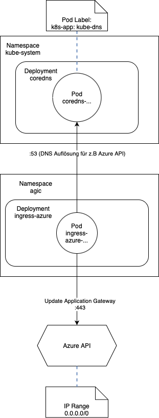

# AGIC Kommunikation 


<!-- BEGIN_TF_DOCS -->


### Examples

```hcl
module "resource_group" {
  #source = "git@gitlab.prd.materna.digital:components/terraform/azure/az-rg"
  source = "git@gitlab.prd.materna.work:components/terraform/azure/az-rg"

  global_subscription_id      = local.global_subscription_id
  global_stage                = local.global_stage
  global_hyperscaler          = local.global_hyperscaler
  global_hyperscaler_location = local.global_hyperscaler_location

  materna_customer_name  = local.materna_customer_name
  materna_project_number = local.materna_project_number
  materna_cost_center    = local.materna_cost_center

  resource_group_location = local.global_hyperscaler_location_long
  resource_group_instance = 1

  tags = local.tags
}

module "route_table" {
  #source = "git@gitlab.prd.materna.digital:components/terraform/azure/az-route"
  source = "git@gitlab.prd.materna.work:components/terraform/azure/az-route"


  global_subscription_id      = local.global_subscription_id
  global_stage                = local.global_stage
  global_hyperscaler          = local.global_hyperscaler
  global_hyperscaler_location = local.global_hyperscaler_location

  materna_customer_name  = local.materna_customer_name
  materna_project_number = local.materna_project_number
  materna_cost_center    = local.materna_cost_center

  resource_group_name = module.resource_group.rg_name

  tags = local.tags
}

module "public_ip_ngw" {
  #source = "git@gitlab.prd.materna.digital:components/terraform/azure/az-pip"
  source = "git@gitlab.prd.materna.work:components/terraform/azure/az-pip"

  global_subscription_id      = local.global_subscription_id
  global_stage                = local.global_stage
  global_hyperscaler          = local.global_hyperscaler
  global_hyperscaler_location = local.global_hyperscaler_location

  materna_customer_name  = local.materna_customer_name
  materna_project_number = local.materna_project_number
  materna_cost_center    = local.materna_cost_center

  resource_group_name = module.resource_group.rg_name
  public_ip_instance  = 2

  tags = local.tags
}


module "nat_gateway" {
  #source = "git@gitlab.prd.materna.digital:components/terraform/azure/az-ngw"
  source = "git@gitlab.prd.materna.work:components/terraform/azure/az-ngw"

  global_subscription_id      = local.global_subscription_id
  global_stage                = local.global_stage
  global_hyperscaler          = local.global_hyperscaler
  global_hyperscaler_location = local.global_hyperscaler_location

  materna_customer_name  = local.materna_customer_name
  materna_project_number = local.materna_project_number
  materna_cost_center    = local.materna_cost_center

  resource_group_name = module.resource_group.rg_name

  public_ip = {
    name                = module.public_ip_ngw.pip_name
    resource_group_name = module.public_ip_ngw.rg_name
  }

  nat_gateway_instance = 1

  tags = local.tags
}


module "subnet" {
  #source = "git@gitlab.prd.materna.digital:components/terraform/azure/az-snet"
  source = "git@gitlab.prd.materna.work:components/terraform/azure/az-snet"

  global_subscription_id      = local.global_subscription_id
  global_stage                = local.global_stage
  global_hyperscaler          = local.global_hyperscaler
  global_hyperscaler_location = local.global_hyperscaler_location

  materna_customer_name  = local.materna_customer_name
  materna_project_number = local.materna_project_number
  materna_cost_center    = local.materna_cost_center

  resource_group_name = local.network_resource_group_name
  subnet_instance     = 1
  vnet_name           = local.vnet_name
  address_prefix      = "10.26.6.192/28"

  associated_route_table = {
    name                = module.route_table.route_name
    resource_group_name = module.route_table.rg_name
  }
  nat_gateway = {
    name                = module.nat_gateway.ngw_name
    resource_group_name = module.nat_gateway.rg_name
  }
}

module "subnet_2" {
  #source = "git@gitlab.prd.materna.digital:components/terraform/azure/az-snet"
  source = "git@gitlab.prd.materna.work:components/terraform/azure/az-snet"

  global_subscription_id      = local.global_subscription_id
  global_stage                = local.global_stage
  global_hyperscaler          = local.global_hyperscaler
  global_hyperscaler_location = local.global_hyperscaler_location

  materna_customer_name  = local.materna_customer_name
  materna_project_number = local.materna_project_number
  materna_cost_center    = local.materna_cost_center

  resource_group_name = local.network_resource_group_name
  subnet_instance     = 3
  vnet_name           = local.vnet_name
  address_prefix      = "10.26.6.160/28"

  associated_route_table = {
    name                = module.route_table.route_name
    resource_group_name = module.route_table.rg_name
  }
  nat_gateway = {
    name                = module.nat_gateway.ngw_name
    resource_group_name = module.nat_gateway.rg_name
  }
}

module "subnet_agw" {
  #source = "git@gitlab.prd.materna.digital:components/terraform/azure/az-snet"
  source = "git@gitlab.prd.materna.work:components/terraform/azure/az-snet"

  global_subscription_id      = local.global_subscription_id
  global_stage                = local.global_stage
  global_hyperscaler          = local.global_hyperscaler
  global_hyperscaler_location = local.global_hyperscaler_location

  materna_customer_name  = local.materna_customer_name
  materna_project_number = local.materna_project_number
  materna_cost_center    = local.materna_cost_center

  resource_group_name = local.network_resource_group_name
  subnet_instance     = 2
  vnet_name           = local.vnet_name
  address_prefix      = "10.26.6.176/29"

  associated_route_table = {
    name                = module.route_table.route_name
    resource_group_name = module.route_table.rg_name
  }
}


module "public_ip_agw" {
  #source = "git@gitlab.prd.materna.digital:components/terraform/azure/az-pip"
  source = "git@gitlab.prd.materna.work:components/terraform/azure/az-pip"

  global_subscription_id      = local.global_subscription_id
  global_stage                = local.global_stage
  global_hyperscaler          = local.global_hyperscaler
  global_hyperscaler_location = local.global_hyperscaler_location

  materna_customer_name  = local.materna_customer_name
  materna_project_number = local.materna_project_number
  materna_cost_center    = local.materna_cost_center

  resource_group_name = module.resource_group.rg_name
  public_ip_instance  = 1


  tags = local.tags
}

module "agw" {
  #source = "git@gitlab.prd.materna.digital:components/terraform/azure/az-agw"
  source = "git@gitlab.prd.materna.work:components/terraform/azure/az-agw"


  global_subscription_id      = local.global_subscription_id
  global_stage                = local.global_stage
  global_hyperscaler          = local.global_hyperscaler
  global_hyperscaler_location = local.global_hyperscaler_location

  materna_customer_name  = local.materna_customer_name
  materna_project_number = local.materna_project_number
  materna_cost_center    = local.materna_cost_center

  resource_group_name         = module.resource_group.rg_name
  public_ip_name              = module.public_ip_agw.pip_name
  agic_service_principal_name = local.agic_service_principal_name

  subnet = {
    name                        = module.subnet_agw.snet_name
    network_name                = module.subnet_agw.vnet_name
    network_resource_group_name = module.subnet_agw.rg_name
  }
  tags = local.tags

}


module "cr" {
  #source = "git@gitlab.prd.materna.digital:components/terraform/azure/az-cr"
  source = "git@gitlab.prd.materna.work:components/terraform/azure/az-cr"

  providers = {
    azurerm        = azurerm,
    azurerm.common = azurerm.common
  }

  global_subscription_id      = local.global_subscription_id
  global_stage                = local.global_stage
  global_hyperscaler          = local.global_hyperscaler
  global_hyperscaler_location = local.global_hyperscaler_location

  materna_customer_name  = local.materna_customer_name
  materna_project_number = local.materna_project_number
  materna_cost_center    = local.materna_cost_center

  resource_group_name = module.resource_group.rg_name
  tags                = local.tags


  container_registry_instance = 1

  private_endpoint = {
    instance = 1
  }
}

module "key_vault" {
  providers = {
    azurerm        = azurerm,
    azurerm.common = azurerm.common
  }
  #source = "git@gitlab.prd.materna.digital:components/terraform/azure/az-kv"
  source = "git@gitlab.prd.materna.work:components/terraform/azure/az-kv"

  global_subscription_id      = local.global_subscription_id
  global_stage                = local.global_stage
  global_tenant_id            = local.global_tenant_id
  global_hyperscaler          = local.global_hyperscaler
  global_hyperscaler_location = local.global_hyperscaler_location

  materna_customer_name  = local.materna_customer_name
  materna_project_number = local.materna_project_number
  materna_cost_center    = local.materna_cost_center

  resource_group_name = module.resource_group.rg_name

  tags = local.tags

  key_vault_instance = 1

  private_endpoint = {
    instance = 3
  }
}

module "disk_encryption_set" {
  #source = "git@gitlab.prd.materna.digital:components/terraform/azure/az-des"
  source = "git@gitlab.prd.materna.work:components/terraform/azure/az-des"


  global_subscription_id      = local.global_subscription_id
  global_stage                = local.global_stage
  global_hyperscaler          = local.global_hyperscaler
  global_hyperscaler_location = local.global_hyperscaler_location

  materna_customer_name  = local.materna_customer_name
  materna_project_number = local.materna_project_number
  materna_cost_center    = local.materna_cost_center

  resource_group_name = module.resource_group.rg_name

  tags = local.tags

  disk_encryption_set_instance = 1
  key_vault_key_instance       = 1

  key_vault = {
    name                = module.key_vault.kv_name
    resource_group_name = module.key_vault.rg_name
  }
}

module "aks" {
  # Route table association requiered at this point
  depends_on = [
    module.subnet,
    module.subnet_2,
    module.disk_encryption_set,
    module.key_vault
  ]

  providers = {
    helm = helm.this,
  }

  source = "../../"

  global_subscription_id      = local.global_subscription_id
  global_tenant_id            = local.global_tenant_id
  global_stage                = local.global_stage
  global_hyperscaler          = local.global_hyperscaler
  global_hyperscaler_location = local.global_hyperscaler_location

  materna_customer_name  = local.materna_customer_name
  materna_project_number = local.materna_project_number
  materna_cost_center    = local.materna_cost_center

  aks_resourcegroup_name      = module.resource_group.rg_name
  aks_cluster_admins          = ["j2cp-aks-admin", "j2cp-aks-contributor"]
  aks_kubernetes_version      = "1.25.5"
  agic_service_principal_name = local.agic_service_principal_name

  system_node_pool = {
    subnet = {
      name                        = module.subnet.snet_name
      network_name                = module.subnet.vnet_name
      network_resource_group_name = module.subnet.rg_name
    }
  }

  additional_node_pools = {
    p1 = {
      subnet = {
        name                        = module.subnet_2.snet_name
        network_name                = module.subnet_2.vnet_name
        network_resource_group_name = module.subnet_2.rg_name
      }
    }
  }

  container_registry = {
    name                = module.cr.cr_name
    resource_group_name = module.cr.rg_name
  }

  application_gateway = {
    name                = module.agw.agw_name
    resource_group_name = module.agw.rg_name
    subscription_id     = module.agw.subscription_id
  }

  encryption = {
    disk_encryption_set = {
      name                = module.disk_encryption_set.des_name
      resource_group_name = module.disk_encryption_set.rg_name
    }
    key_vault = {
      name                = module.key_vault.kv_name
      resource_group_name = module.key_vault.rg_name
      key_vault_key = {
        name = module.disk_encryption_set.kvk_name
      }
    }
  }

  route_table_id = module.route_table.route_id

  aks_instance_id                          = 1
  resource_group_kubernetes_nodes_instance = 2

  tags = local.tags
}


```

### Generic examples
copy this and fill with your values

```hcl
module "example" {
	 source  = "<module-path>"

	 # Required variables
	 agic_service_principal_name  = 
	 aks_resourcegroup_name  = 
	 application_gateway  = 
	 global_hyperscaler  = 
	 global_hyperscaler_location  = 
	 global_stage  = 
	 global_tenant_id  = 
	 materna_cost_center  = 
	 materna_customer_name  = 
	 materna_project_number  = 
	 route_table_id  = 
	 tags  = 

	 # Optional variables
	 additional_node_pools  = {}
	 aks_cluster_admins  = []
	 aks_instance_id  = 1
	 aks_kubernetes_version  = null
	 aks_local_account_disabled  = false
	 aks_pod_cidr  = "10.244.0.0/16"
	 aks_sku_tier  = "Free"
	 apply_helm  = true
	 cluster_dns_prefix  = "k8s"
	 container_registry  = null
	 dns_zone  = null
	 enable_network_policy  = true
	 encryption  = null
	 global_subscription_id  = ""
	 resource_group_kubernetes_nodes_instance  = 2
	 resource_group_kubernetes_nodes_materna_project_number  = null
	 resource_group_location  = "GermanyWestCentral"
	 system_node_pool  = null
}
```

#### Providers

| Name | Version |
|------|---------|
| <a name="provider_azuread"></a> [azuread](#provider_azuread) | ~> 2.29 |
| <a name="provider_azurecaf"></a> [azurecaf](#provider_azurecaf) | 1.2.23 |
| <a name="provider_azurerm"></a> [azurerm](#provider_azurerm) | ~>3.28 |
| <a name="provider_azurerm.common"></a> [azurerm.common](#provider_azurerm.common) | ~>3.28 |
| <a name="provider_helm"></a> [helm](#provider_helm) | 2.9.0 |
| <a name="provider_local"></a> [local](#provider_local) | n/a |

#### Inputs

| Name | Description | Type |
|------|-------------|------|
| <a name="input_agic_service_principal_name"></a> [agic_service_principal_name](#input_agic_service_principal_name) | Service principal that has Reader rights to the resource group of the application gateway and Contributor right to the application gateway | `string` |
| <a name="input_aks_resourcegroup_name"></a> [aks_resourcegroup_name](#input_aks_resourcegroup_name) | Name of the ResourceGroup to use. | `string` |
| <a name="input_application_gateway"></a> [application_gateway](#input_application_gateway) | Application Gateway parameters for agic | <pre>object({<br>    name                = string<br>    resource_group_name = string<br>    subscription_id     = string<br>    }<br>  )</pre> |
| <a name="input_global_hyperscaler"></a> [global_hyperscaler](#input_global_hyperscaler) | Kennzeichen für den Hyperscaler | `string` |
| <a name="input_global_hyperscaler_location"></a> [global_hyperscaler_location](#input_global_hyperscaler_location) | Kennzeichen für den Hyperscaler Region | `string` |
| <a name="input_global_stage"></a> [global_stage](#input_global_stage) | Staging Umgebung | `string` |
| <a name="input_global_tenant_id"></a> [global_tenant_id](#input_global_tenant_id) | n/a | `string` |
| <a name="input_materna_cost_center"></a> [materna_cost_center](#input_materna_cost_center) | Materna cost center | `string` |
| <a name="input_materna_customer_name"></a> [materna_customer_name](#input_materna_customer_name) | Name of the customer (max. 5 characters). | `string` |
| <a name="input_materna_project_number"></a> [materna_project_number](#input_materna_project_number) | Materna internal project nummer | `string` |
| <a name="input_route_table_id"></a> [route_table_id](#input_route_table_id) | Route table id of subnet | `string` |
| <a name="input_tags"></a> [tags](#input_tags) | Tags for the deployment | `map(any)` |
| <a name="input_additional_node_pools"></a> [additional_node_pools](#input_additional_node_pools) | Additional node pools | <pre>map(object({<br>    vm_size                = optional(string, "Standard_B2s")<br>    node_count             = optional(number, 1)<br>    max_pods               = optional(number, 40)<br>    enable_auto_scaling    = optional(bool, false)<br>    node_min_count         = optional(number, null)<br>    node_max_count         = optional(number, null)<br>    scale_down_mode        = optional(string, "Delete") # Delete | Deallocate<br>    enable_host_encryption = optional(bool, false)<br>    kubelet_disk_type      = optional(string, "OS")     # OS | Temporary --- Failure for 'Temporary': Preview feature Microsoft.ContainerService/KubeletDisk not registered.<br>    mode                   = optional(string, "User")   # System | User<br>    node_taints            = optional(list(string), []) # e.g. key=value:NoSchedule<br>    orchestrator_version   = optional(string)<br>    os_disk_size_gb        = optional(number)<br>    os_disk_type           = optional(string, "Managed") # Ephemeral | Managed<br>    ultra_ssd_enabled      = optional(bool, false)<br>    subnet = object({<br>      name                        = string<br>      network_name                = string<br>      network_resource_group_name = string<br>    })<br>    kubelet_config = optional(object({<br>      allowed_unsafe_sysctls    = optional(list(string), [])<br>      container_log_max_line    = optional(number, null) # > 2<br>      container_log_max_size_mb = optional(number, null)<br>      cpu_cfs_quota_enabled     = optional(bool, null)<br>      cpu_cfs_quota_period      = optional(string, null)<br>      cpu_manager_policy        = optional(string, null) # none | static<br>      image_gc_high_threshold   = optional(number, null) # 0-100<br>      image_gc_low_threshold    = optional(number, null) # 0-100<br>      pod_max_pid               = optional(number, null)<br>      topology_manager_policy   = optional(string, null) # none | best-effort | restricted | single-numa-node<br>      }), {}<br>    )<br>  }))</pre> |
| <a name="input_aks_cluster_admins"></a> [aks_cluster_admins](#input_aks_cluster_admins) | Display Name of the Activce Directory Group unsed for Kubernetes Cluster Admins. | `list(string)` |
| <a name="input_aks_instance_id"></a> [aks_instance_id](#input_aks_instance_id) | Internal deployment number for resource group. | `number` |
| <a name="input_aks_kubernetes_version"></a> [aks_kubernetes_version](#input_aks_kubernetes_version) | Version of Kubernetes, if a fixed version should deployed | `string` |
| <a name="input_aks_local_account_disabled"></a> [aks_local_account_disabled](#input_aks_local_account_disabled) | Local accounts will be disabled. Possible values are true or [false] | `bool` |
| <a name="input_aks_pod_cidr"></a> [aks_pod_cidr](#input_aks_pod_cidr) | Cidr block for pods | `string` |
| <a name="input_aks_sku_tier"></a> [aks_sku_tier](#input_aks_sku_tier) | The SKU Tier that should be used for this Kubernetes Cluster. Possible values are Free and Paid (which includes the Uptime SLA). | `string` |
| <a name="input_apply_helm"></a> [apply_helm](#input_apply_helm) | Apply Helm Chart for agic | `bool` |
| <a name="input_cluster_dns_prefix"></a> [cluster_dns_prefix](#input_cluster_dns_prefix) | DNS prefix in kubernets cluster. | `string` |
| <a name="input_container_registry"></a> [container_registry](#input_container_registry) | Container registry to connect AKS cluster to | <pre>object({<br>    name                = string<br>    resource_group_name = string<br>    }<br>  )</pre> |
| <a name="input_dns_zone"></a> [dns_zone](#input_dns_zone) | DNS Zone | <pre>object({<br>    name                = string<br>    resource_group_name = string<br>    }<br>  )</pre> |
| <a name="input_enable_network_policy"></a> [enable_network_policy](#input_enable_network_policy) | n/a | `bool` |
| <a name="input_encryption"></a> [encryption](#input_encryption) | Encryption parameters | <pre>object({<br>    disk_encryption_set = object({<br>      name                = string<br>      resource_group_name = string<br>    })<br>    key_vault = object({<br>      name                = string<br>      resource_group_name = string<br>      key_vault_key = object({<br>        name = string<br>      })<br>    })<br>    }<br>  )</pre> |
| <a name="input_global_subscription_id"></a> [global_subscription_id](#input_global_subscription_id) | n/a | `string` |
| <a name="input_resource_group_kubernetes_nodes_instance"></a> [resource_group_kubernetes_nodes_instance](#input_resource_group_kubernetes_nodes_instance) | Instance of resource group which Kubernetes will create | `string` |
| <a name="input_resource_group_kubernetes_nodes_materna_project_number"></a> [resource_group_kubernetes_nodes_materna_project_number](#input_resource_group_kubernetes_nodes_materna_project_number) | Define separate project number for Kubernetes node resource group | `string` |
| <a name="input_resource_group_location"></a> [resource_group_location](#input_resource_group_location) | The location for the AKS Cluster. | `string` |
| <a name="input_system_node_pool"></a> [system_node_pool](#input_system_node_pool) | System node pool parameters | <pre>object({<br>    type                = optional(string, "VirtualMachineScaleSets") # [AvailabilitySet | VirtualMachineScaleSets]<br>    ultra_ssd_enabled   = optional(bool, false)<br>    node_count          = optional(number, 3)<br>    node_min_count      = optional(number, 3)<br>    node_max_count      = optional(number, 10)<br>    enable_auto_scaling = optional(bool, false)<br>    os_disk_type        = optional(string, "Managed") # [Ephemeral | Managed]<br>    os_disk_size_gb     = optional(number)<br>    vm_size             = optional(string, "Standard_B2s")<br>    max_pods            = optional(number, 40)<br>    name_extension      = optional(string, "system")<br>    enable_public_ip    = optional(bool, false)<br>    subnet = object({<br>      name                        = string<br>      network_name                = string<br>      network_resource_group_name = string<br>    })<br>  })</pre> |


#### Resources

- resource.azuread_application_password.agic (main.tf#271)
- resource.azurecaf_name.aks (main.tf#11)
- resource.azurecaf_name.identity (main.tf#18)
- resource.azurecaf_name.resource_group_kubernetes_nodes (main.tf#25)
- resource.azurerm_kubernetes_cluster.this (main.tf#32)
- resource.azurerm_kubernetes_cluster_node_pool.this (main.tf#134)
- resource.azurerm_role_assignment.cr (main.tf#258)
- resource.azurerm_role_assignment.des (main.tf#245)
- resource.azurerm_role_assignment.network (main.tf#235)
- resource.azurerm_role_assignment.private_dns (main.tf#210)
- resource.azurerm_role_assignment.public_dns (main.tf#219)
- resource.azurerm_role_assignment.route (main.tf#204)
- resource.azurerm_user_assigned_identity.this (main.tf#191)
- resource.helm_release.ingress_azure (main.tf#281)
- resource.local_file.kubeconfig (main.tf#182)
- data source.azuread_application.agic (references.tf#35)
- data source.azuread_group.this (references.tf#2)
- data source.azuread_service_principal.agic (references.tf#31)
- data source.azurerm_container_registry.cr (references.tf#46)
- data source.azurerm_disk_encryption_set.des (references.tf#52)
- data source.azurerm_dns_zone.dns (references.tf#77)
- data source.azurerm_key_vault.kv (references.tf#59)
- data source.azurerm_key_vault_key.kvk (references.tf#68)
- data source.azurerm_kubernetes_service_versions.this (references.tf#7)
- data source.azurerm_resource_group.this (references.tf#12)
- data source.azurerm_subnet.additional_node_pools (references.tf#39)
- data source.azurerm_subnet.system_node_pool (references.tf#25)
- data source.azurerm_subscription.this (references.tf#16)
- data source.azurerm_user_assigned_identity.agentpool (references.tf#86)
- data source.azurerm_virtual_network.system_node_pool (references.tf#20)


<!-- END_TF_DOCS -->